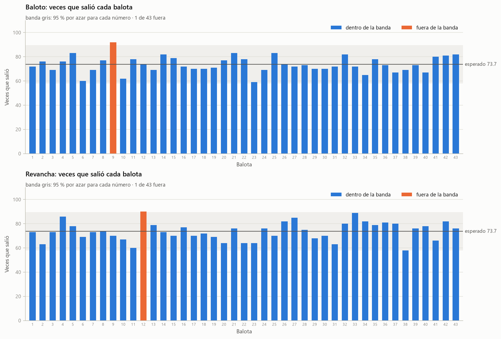
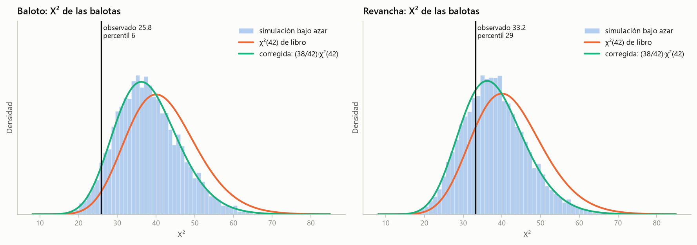
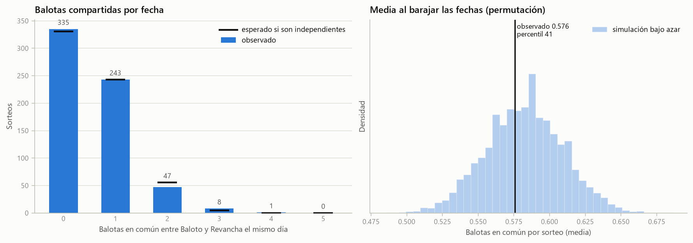
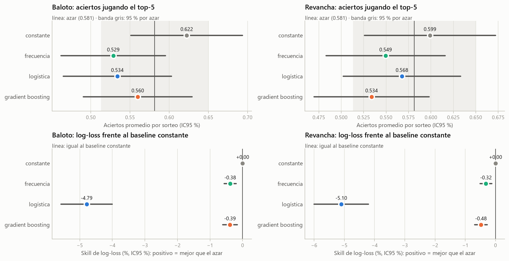
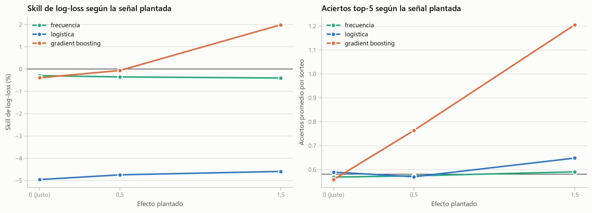
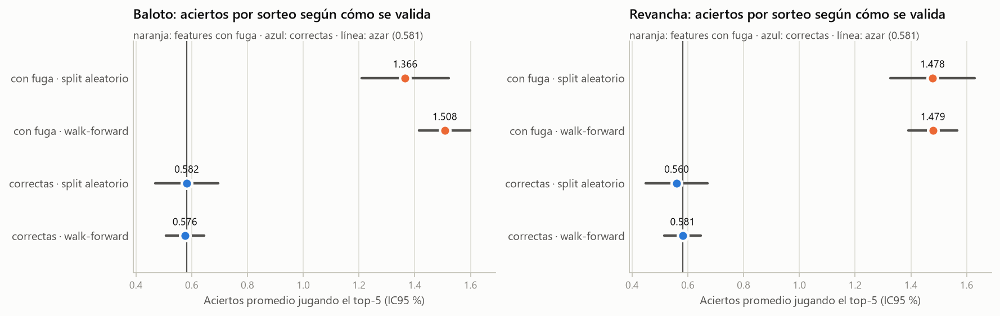
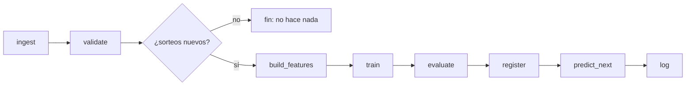

# baloto-fun-ML

> **Experimento educativo. El Baloto es aleatorio; este modelo no predice resultados. Juega con responsabilidad.**

Pipeline reproducible de ciencia de datos que busca señal predictiva en los sorteos del Baloto de
Colombia y comunica con honestidad el resultado esperado: **no hay señal explotable**, porque el
sorteo es aleatorio. El valor del proyecto está en la ingeniería (validación correcta, baselines,
reentrenamiento automatizado y un registro de predicciones en vivo que nadie puede maquillar),
no en "ganarle" a la lotería.

## El juego en números

| Concepto | Valor |
|---|---|
| Balotas principales | 5 distintas entre 1 y 43 (conjunto: el orden no importa) |
| Superbalota | 1 entre 1 y 16 (otro bombo) |
| Probabilidad del premio mayor | 1 en C(43,5) x 16 = **15.401.568** |
| Aciertos esperados por azar (5 números) | 5 x 5/43 ≈ **0,581** por sorteo |
| Baloto Revancha | Sorteo independiente con el mismo formato; se analiza por separado |
| Calendario | Miércoles y sábado; **desde el 2 de junio de 2025 (sorteo 2508) también lunes** |

Los números son etiquetas nominales, no cantidades: nunca se promedian balotas ni se hace
regresión sobre su valor.

## Datos

| Fuente | Qué trae | Formato |
|---|---|---|
| `data/raw/resultados_{baloto,revancha}.csv` | Histórico 2021-05-01 -> 2026-05-23 (sorteos 2081-2660) | Original: `Date, C1..C5, SB, #Sorteo` |
| `data/incoming/*.csv` | Sorteos nuevos (manuales o descargados); hoy, 2661-2714 (hasta el 2026-09-26) traídos de baloto.com | Esquema común, con columna `juego` |
| baloto.com (`WebSource`) | Página pública por sorteo | Se guarda en `data/incoming/web_*.csv` |

Estado actual de `data/processed/draws.csv`: **634 sorteos por juego** (2081-2714, del 2021-05-01 al
2026-09-26), sin errores ni avisos, y Baloto/Revancha alineados 1:1 en fecha y numeración.

**Esquema común** (`data/processed/draws.csv`): `fecha, n_sorteo, juego, b1..b5, superbalota`, con
`juego` en {`baloto`, `revancha`} y las balotas ordenadas de menor a mayor.

**Validaciones, por juego:** formato 5/43 + 1/16, balotas sin repetir, rangos, sin filas ni
números de sorteo duplicados, numeración sin saltos, fechas crecientes, fechas dentro del
calendario (aviso) y ningún sorteo ya registrado que llegue con otro resultado. Además se
cruzan Baloto y Revancha: cada sorteo debe existir en ambos juegos con la misma fecha. El
resultado queda en `reports/validation.json`.

### Descarga desde baloto.com, de forma responsable

`WebSource` lee `https://www.baloto.com/resultados-{baloto,revancha}/<n_sorteo>`:

- respeta `robots.txt` (hoy solo prohíbe `/admin-baloto/` y `/api/`; no se usa la API);
- se identifica con un User-Agent honesto que enlaza a este repo, y espera 2,5 s entre peticiones;
- **no intenta eludir bloqueos**: ante 401/403/429 se detiene. Desde IPs de datacenter (Kaggle,
  posiblemente GitHub Actions) el sitio responde 403; en ese caso se usa la fuente manual;
- no sigue redirecciones: un sorteo que aún no existe redirige a `/resultados` (que muestra el
  último sorteo), y seguirla duplicaría ese resultado con otro número;
- valida lo descargado junto con el histórico **antes** de escribir nada en `data/incoming/`.

## ¿Hay algo que aprender? Chequeos de los datos

Antes de entrenar nada se comprueba lo que tendría que fallar para que existiera señal: que las
balotas salgan con la misma frecuencia (uniformidad) y que los sorteos sean independientes. Detalle
y gráficos en [`notebooks/01_exploracion_uniformidad.ipynb`](notebooks/01_exploracion_uniformidad.ipynb);
cifras en `reports/analysis.json`. Son 634 sorteos por juego, y los p-valores Monte Carlo usan
10.000 historiales simulados.

| Uniformidad | Baloto | Revancha |
|---|---|---|
| Balotas: X² (42 gl) | 25,8 | 33,2 |
| p aproximado (χ² de libro) | 0,976 | 0,833 |
| p corregido (X² · 42/38) | 0,944 | 0,704 |
| p Monte Carlo (exacto) | 0,944 | 0,715 |
| Superbalota: X² (15 gl) y p Monte Carlo | 11,2 · p = 0,725 | 14,5 · p = 0,490 |

**Independencia Baloto vs. Revancha** (634 fechas con ambos sorteos):
- comparten en promedio 0,576 balotas por fecha, frente a 0,581 esperadas (hipergeométrica);
  p de permutación = 0,82;
- la superbalota coincide 30 veces, frente a 39,6 esperadas; p binomial = 0,12;
- la mayor |correlación| entre las 43 × 43 parejas de balotas es 0,149; p de permutación = 0,47.

Ninguna prueba rechaza la hipótesis de un sorteo justo e independiente.







### El listón: baselines en walk-forward

Todo modelo se evalúa fuera de muestra en la misma ventana: 384 sorteos por juego (del 2331 al
2714, entre el 2023-09-23 y el 2026-09-26). Detalle en `reports/evaluation/<juego>.json`.

| Juego | Baseline | Aciertos top-5 (IC95 %) | Log-loss por balota | Skill vs. constante | Accuracy superbalota |
|---|---|---|---|---|---|
| Baloto | constante | 0,622 [0,551; 0,694] | 0,3594 | 0 | 0,049 |
| Baloto | frecuencia | 0,529 [0,462; 0,595] | 0,3608 | −0,38 % | 0,057 |
| Revancha | constante | 0,599 [0,526; 0,672] | 0,3594 | 0 | 0,068 |
| Revancha | frecuencia | 0,549 [0,483; 0,616] | 0,3606 | −0,32 % | 0,062 |

Por azar se esperan 0,581 aciertos por sorteo (banda del 95 % para 384 sorteos: 0,513-0,650), una
log-loss de 0,3594 por balota y un accuracy de 1/16 = 0,0625 en la superbalota. El "top-5" del
baseline constante es una jugada al azar, con empates rotos con semilla.

## Modelos: ¿encuentran algo? No

Detalle en [`notebooks/03_resultados_modelos.ipynb`](notebooks/03_resultados_modelos.ipynb).

**Features** (solo sorteos anteriores al objetivo): para cada número, su frecuencia en los últimos
10, 30 y 100 sorteos, los sorteos desde su última aparición y una tendencia (frecuencia de los
últimos 15 menos la de los 15 anteriores); además, el día de la semana. Un test verifica que las
features de cada sorteo se pueden calcular sin conocer ese sorteo ni ninguno posterior.

**Modelos**, con hiperparámetros fijados antes de ver resultados:
- **Logística multietiqueta**: una regresión logística por balota (43) y por superbalota (16),
  L2 con C = 1. Es el modelo de producción, elegido a priori.
- **Gradient boosting compartido**: un `HistGradientBoostingClassifier` para las 43 balotas en
  formato largo (una fila por sorteo y número), sin la identidad del número y sin early stopping,
  porque su validación interna es un split aleatorio.

| Juego | Modelo | Aciertos top-5 (IC95 %) | Skill log-loss vs. constante | p Monte Carlo (aciertos · log-loss) |
|---|---|---|---|---|
| Baloto | logística | 0,534 [0,465; 0,603] | −4,79 % | 0,92 · 0,79 |
| Baloto | gradient boosting | 0,560 [0,490; 0,629] | −0,39 % | 0,74 · 0,53 |
| Revancha | logística | 0,568 [0,502; 0,633] | −5,10 % | 0,66 · 0,82 |
| Revancha | gradient boosting | 0,534 [0,470; 0,598] | −0,48 % | 0,92 · 0,93 |

Ningún modelo supera al azar en aciertos, y todos quedan por debajo del baseline constante en
log-loss (IC95 % del Δ enteramente desfavorable). Las pruebas de significancia coinciden:

- **Monte Carlo sobre los resultados** (10.000 secuencias de sorteos justos con las predicciones
  fijas): en aciertos y log-loss de las balotas, todos los p-valores de "mejor que el azar" están
  por encima de 0,5; en la superbalota el menor es 0,12 (accuracy de la logística en Baloto).
- **Combinaciones ganadoras según el modelo**: la combinación que de verdad ganó cae, en promedio,
  en el percentil 49 (Baloto) y 50 (Revancha) entre 2000 jugadas al azar puntuadas por la
  logística antes del sorteo. KS contra uniforme: p = 0,62 y 0,87.
- **Permutación y historiales sintéticos con reentrenamiento** (etapa `significance`): el
  skill de log-loss observado queda en percentiles 6-76 de sus distribuciones nulas; ningún p baja
  de 0,23. Se usaron 200 permutaciones por modelo y juego, 1000 historiales sintéticos para la
  logística y 200 para el boosting.



### Control positivo: ¿el método vería una señal si existiera?

Un resultado negativo solo vale si el método detecta una señal real. En historiales sintéticos
con una señal plantada, en que lo que salió en el sorteo anterior pesa 1,5 o 2,5 veces más:

| Modelo | Sin señal | Efecto 0,5 | Efecto 1,5 |
|---|---|---|---|
| gradient boosting: aciertos · skill | 0,559 · −0,39 % | 0,764 · −0,06 % | **1,206 · +1,99 %** |
| logística: aciertos · skill | 0,590 · −4,95 % | 0,570 · −4,74 % | 0,648 · −4,59 % |

El gradient boosting detecta la señal: su resultado negativo con datos reales es informativo. La
logística por balota reacciona en aciertos, pero **nunca** supera al baseline en log-loss. Con ~50
apariciones por balota para aprender 8 coeficientes, la varianza tapa cualquier señal. Ningún C la
salva (ver el notebook): regularizar más la acerca al constante y la vuelve ciega. C se quedó en su
valor a priori, porque elegirlo mirando resultados sería otra forma de buscar hasta encontrar.



**Una corrección, contada con honestidad.** La primera versión de la logística estandarizaba todo,
incluida la variable "lunes", que casi siempre vale 0 al comienzo: con 2 o 3 lunes en el
entrenamiento, un lunes quedaba a ~10 desviaciones estándar y dejaba sin efecto la regularización.
La sequía (sorteos desde la última aparición) tiene cola larga y la logística extrapolaba. Resultado:
probabilidades de hasta 0,99 para una balota y un skill de −7,5 % (Baloto) y −8,4 % (Revancha). Se
corrigió con indicadores sin escalar y `log1p` en la sequía, sin tocar ningún hiperparámetro. La
versión inicial se conserva (`PerNumberLogistic(legacy_preprocessing=True)`) para reproducir el
hallazgo.

### La trampa: cómo "predecir" la lotería sin darse cuenta

[`notebooks/02_trampa_split_aleatorio.ipynb`](notebooks/02_trampa_split_aleatorio.ipynb) muestra,
marcado como **lo que no se debe hacer**, cómo una sola línea sin `.shift(1)` fabrica un modelo
"ganador":

| Features | Validación | Aciertos top-5 (Baloto) |
|---|---|---|
| con fuga (la ventana incluye el sorteo) | split aleatorio | **1,366** |
| con fuga | walk-forward | **1,508** |
| correctas (solo pasado) | split aleatorio | 0,582 |
| correctas | walk-forward | 0,576 |

En una lotería el culpable principal es la fuga en las features; el split aleatorio igual queda
prohibido porque no imita el uso real, mezcla épocas y, en series con estructura temporal, sí
filtra información. La segunda trampa es probar 80 estrategias de números "calientes" y "fríos" y
quedarse con la mejor: en la primera mitad del periodo logra 0,688 aciertos, por encima de la banda
del azar, y en la segunda mitad cae a 0,547.



## Pipeline de reentrenamiento

Cada etapa es una función con entradas y salidas en disco, invocable sola (`uv run baloto-ml
<etapa>` o `make <objetivo>`). `pipeline` las encadena y aplica la regla central: **solo se
reentrena si hay sorteos nuevos y validados**. Si no los hay, termina sin tocar ningún archivo.



| Etapa | Lee | Escribe |
|---|---|---|
| `ingest` | `data/raw/`, `data/incoming/*.csv` (y opcionalmente baloto.com) | `data/interim/new_draws.csv` |
| `validate` | lo anterior + `data/processed/draws.csv` | `data/processed/draws.csv`, `reports/validation.json` |
| `build-features` | `data/processed/draws.csv` | `data/processed/features/<juego>.npz` |
| `train` | draws + features (verifica que coincidan) | `models/_staging/<juego>/` |
| `evaluate` | draws | `reports/analysis.json`, `reports/evaluation/<juego>.json` |
| `register` | staging + evaluación | `models/<juego>/<fecha>_<hash>/`, `models/<juego>/latest` |
| `predict-next` | modelo vigente + draws | una fila más en `predictions/predictions_log.csv` |
| `log` (`reconcile`) | registros + draws | filas nuevas en `predictions/reconciliation_log.csv`, `reports/live_summary.json` |

**Registro de modelos.** Cada versión guarda `model.joblib` (los dos clasificadores; el de
producción es la logística) y `metadata.json`, con las fechas y el número de sorteos del
entrenamiento, los hiperparámetros, la semilla, las métricas walk-forward, la versión y el hash
del código, el commit y las versiones de las librerías. El identificador `<fecha del último
sorteo>_<hash>` depende solo de las entradas (datos, código y configuración): entrenar otra vez
con lo mismo produce el mismo id. `latest` es un archivo de texto, porque los symlinks no son
portables en Windows. Se conservan las 10 versiones más recientes en el árbol de trabajo, y git
guarda el resto.

## Registro de predicciones en vivo

Es la parte que da credibilidad al experimento: cualquiera puede "predecir" el pasado. Aquí cada
predicción queda escrita, con fecha y hora, **antes** del sorteo, y nunca se modifica.

- **`predict_next`** agrega a `predictions/predictions_log.csv` una fila por juego con el sorteo
  objetivo (número y fecha según el calendario), la versión del modelo, las 43 + 16
  probabilidades y la combinación sugerida (las 5 balotas y la superbalota más probables).
- **Reglas.** Hay una sola predicción por sorteo, y vale la primera. Solo se registra hasta las
  8:00 p. m. (hora de Colombia) del día del sorteo, y solo con un modelo entrenado con los datos
  actuales. Si los datos están desactualizados, el "próximo" sorteo ya ocurrió y no se registra
  nada: sería predecir el pasado.
- **`log`** (o `reconcile`), cuando llega el resultado, agrega a
  `predictions/reconciliation_log.csv` los aciertos de la combinación sugerida, el acierto de la
  superbalota y la log-loss frente al azar. `reports/live_summary.json` acumula los aciertos del
  modelo frente a los esperados (0,581 por sorteo) con su banda del 95 %.
- **Append-only verificable.** Los dos archivos solo crecen: el código nunca reescribe filas y
  `scripts/check_append_only.py` (`make check-log`) comprueba contra git que el contenido
  anterior sea un prefijo exacto del nuevo. El CI lo corre antes de cada commit, y el historial de
  git más los logs de GitHub Actions sirven de sello de tiempo externo.

## Lecciones sobre validación y baselines

1. **Revisa los supuestos de la prueba de libro.** El χ² clásico supone balotas independientes,
   pero un sorteo no repite números: bajo azar E[X²] = 43 − 5 = 38, no 42. La receta de libro
   infla el p-valor (0,976 contra 0,944 exacto en Baloto). Si hay dudas, simula.
2. **Si el proceso es justo, el baseline constante es imbatible en log-loss.** Cualquier
   desviación del 5/43 cuesta: el baseline de frecuencia histórica empeora la log-loss de forma
   medible (IC95 % del Δ por encima de cero en ambos juegos).
3. **Con 43 números siempre hay una balota "caliente".** El 9 salió 92 veces en Baloto
   (z = 2,26), pero en historiales simulados la mayor desviación es igual o mayor el 68 % de las
   veces. Mirar muchas cosas a la vez exige corregir por comparaciones múltiples.
4. **Una línea sin `.shift(1)` fabrica un modelo "ganador".** Con la fuga, 1,37 aciertos por
   sorteo frente a 0,58 del azar; sin ella, nada. El walk-forward no protege de una feature con
   fuga: la protegen los tests y el registro en vivo, porque una feature que usa el resultado no se
   puede calcular antes del sorteo.
5. **Probar muchas cosas y quedarse con la mejor garantiza encontrar "algo".** La mejor de 80
   estrategias parece ganadora en un periodo y vuelve al azar en el siguiente. Las decisiones se
   fijan antes de mirar y se miden en datos que no participaron en ninguna elección.
6. **Un resultado negativo necesita un control positivo.** Si el método no detecta una señal
   plantada, su "no hay señal" no prueba nada. Aquí el gradient boosting la detecta y la logística
   por balota no, y así se reporta.
7. **Más parámetros, más varianza.** Sobre un proceso aleatorio, cada parámetro extra solo añade
   ruido: la logística con 43 modelos pierde un 5 % de log-loss frente al constante, y solo estimar
   43 interceptos por separado ya cuesta ~0,5 %.
8. **Mira las probabilidades, no solo la métrica.** Una probabilidad de 0,99 para una balota no es
   una predicción audaz: es un defecto (aquí, de escalado). Las probabilidades imposibles son la
   prueba de cordura más barata.

## Cómo ejecutarlo

Requisitos: [uv](https://docs.astral.sh/uv/) (instala Python 3.12 automáticamente).

```bash
uv sync                      # entorno y dependencias
uv run baloto-ml scrape      # (opcional) trae de baloto.com los sorteos que falten
uv run baloto-ml ingest      # detecta sorteos nuevos en data/raw y data/incoming
uv run baloto-ml validate    # valida y actualiza data/processed/draws.csv
uv run baloto-ml pipeline    # todas las etapas; sin sorteos nuevos no hace nada
uv run baloto-ml evaluate    # uniformidad, independencia, walk-forward y Monte Carlo (~1 min)
uv run baloto-ml significance            # permutación e historiales sintéticos (lento: ~1 h)
uv run baloto-ml significance --quick    # la misma etapa con pocas simulaciones (prueba)
uv run python scripts/run_notebooks.py   # re-ejecuta los notebooks (outputs versionados)
uv run pytest                # tests
```

## Estado

Proyecto en construcción, por fases: datos -> baselines -> modelos y validación -> pipeline ->
registro en vivo -> app -> CI. Hechas: datos, baselines y modelos con validación.
